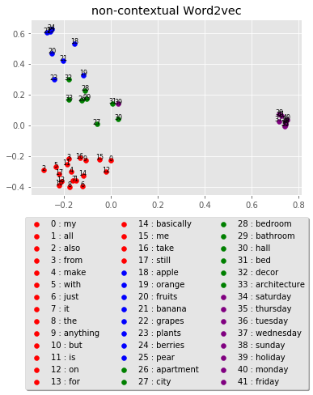

## Table of contents
* [Repository](#Repository)
* [Prerequisites](#Prerequisites)
* [Illustrations](#Illustrations)   
* [Collaborator](#Collaborator)
* [Resources](#Resources)	 

## Repository
The aim of this repository is to analyze BERT and Word2Vec language models. 
We make use of cosine similarity, euclidean distance, as well as Word Mover's Distance (WMD) as a metric to quantify the similarity between sentences and words.
We also showcase some applications of the BERT contexualize embedding.


* [wmd_plot.py](https://github.com/danafaiez/NLP-Project/blob/master/wmd_plot.py) takes two documents, possibly consists of many sentences, 
preprocess them, finds the corresponding word vectors for each token (using Word2Vec embeddings), computes the (Euclidean) distance between all tokens present in both documents,
as well as the frequencies of each unique word in each document. At the end, it computes the WMD between the two documents.
You also have the option to make plots such as the optimal transport matrix.

* The code implementing the WMD to BERT embeddings is available upson request. 

## Prerequisites
   * Project is created using Python 3.6 and Google Cloud/Colab.
   * [Google's pretrained model](https://github.com/mmihaltz/word2vec-GoogleNews-vectors) is used for Word2Vec embeddings.
   * To run this project, install the following:
 
   This repo contains a `TensorFlow 2.0`_ `Keras`_ implementation of
   `google-research/bert` _with support for loading of the original `pre-trained weights`_
   
   ``` 
   $!pip install stop-words
   $!pip install pyemd
   $!pip install bert-for-tf2
   $!pip install matplotlib
   $!pip install sentencepiece
   $!pip install numpy cython
   $!pip install POT
   $!pip install MulticoreTSNE
   $!pip install nltk
   ```

## Illustrations
   The following two imshow plots illustrate the WMD and BMD between every
   sentence pair in this list: 
      
  ["She ran across the yard to the edge of the woods where her brother waited.",
  "She walked across the yard to the edge of the woods where her brother waited.",
  "She walked across the lawn to the edge of the woods where her brother waited.",
  "She walked across the lawn to the beginning of the woods where her brother waited.",
  "She walked across the lawn to the beginning of the forest where her brother waited.",
  "She walked across the lawn to the beginning of the forest where her sibling waited."]
     
      

      
 

   The following plots are illustrations of Word2vec and BERT raw embedings of
   artificially crafted set of words; the first two plots include 4 sets of words which have to context, and
   the last plot includes only BERT embeddings (since Word2vec embeddings are not context dependent) with 2 sets of words similar to the previous set but embedded in 3 sentences.
   Principal component analysis (PCA) technique is used for dimensionality reduction.

   
     
     
     


## Collaborator
   This project is in collaboration with [Drew Bischel](https://github.com/cognagent).

## Resources
   Here are some of the resources we made use of in developing this project:
   * [Peter Baumgartner's blog](https://pmbaumgartner.github.io/blog/word-movers-distance-exploration/)
   * [From Word Embeddings To Document Distances](http://proceedings.mlr.press/v37/kusnerb15.pdf)
   * [google-research/bert/modeling.py](https://github.com/google-research/bert/blob/master/modeling.py)  
   * [Stanford's Contextual Word Similarities(SCWS)](http://ai.stanford.edu/~ehhuang/)
   * [Improving Word Representations via Global Context and Multiple Word Prototypes](https://nlp.stanford.edu/pubs/HuangACL12.pdf)


