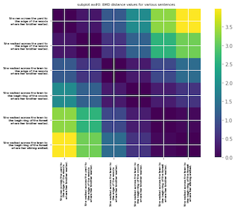

## Table of contents
* [Repository](#Repository)
* [Prerequisites](#Prerequisites)
* [Illustrations](#Illustrations)   
* [Collaborator](#Collaborator)
* [Resources](#Resources)	 

## Repository
The aim of this repository is to analyze BERT and Word2Vec language models. 
We make use of cosine similarity, euclidean distance, as well as Word Mover's Distance (WMD) as a metric to quantify the similarity between sentences and words.
We also showcase some applications of the BERT contexualize embedding.


* [wmd_plot.py](https://github.com/danafaiez/NLP-Project/blob/master/wmd_plot.py) takes two documents, possibly consists of many sentences, 
preprocess them, finds the corresponding word vectors for each token (using Word2Vec embeddings), computes the (Euclidean) distance between all tokens present in both documents,
as well as the frequencies of each unique word in each document. At the end, it computes the WMD between the two documents.
You also have the option to make plots such as the optimal transport matrix.

* Most plot have a dependency on bmd.py which is the implementation of the WMD to BERT embeddings and is available upon request and contains a `TensorFlow 2.0`_ `Keras`_ implementation of
   `google-research/bert` with support for loading of the original `pre-trained weights`.
## Prerequisites
   * Project is created using Python 3.6 and Google Cloud/Colab.
   * [Google's pretrained model](https://github.com/mmihaltz/word2vec-GoogleNews-vectors) is used for Word2Vec embeddings.
   * To run this project, install the following:
 
   
   ``` 
   $!pip install stop-words
   $!pip install pyemd
   $!pip install bert-for-tf2
   $!pip install matplotlib
   $!pip install sentencepiece
   $!pip install numpy cython
   $!pip install POT
   $!pip install MulticoreTSNE
   $!pip install nltk
   ```

## Illustrations

*  The following two imshow plots illustrate the WMD and BMD between every two
   sentences: 
  
  1. "She ran across the yard to the edge of the woods where her brother waited."
  2. "She walked across the yard to the edge of the woods where her brother waited."
  3. "She walked across the lawn to the edge of the woods where her brother waited."
  4. "She walked across the lawn to the beginning of the woods where her brother waited."
  5. "She walked across the lawn to the beginning of the forest where her brother waited."
  6. "She walked across the lawn to the beginning of the forest where her sibling waited."

 
 

* The following plots are illustrations of BERT raw embedings of artificially crafted set of words; the first plot includes 4 sets of words which have no context, and
   the last plot includes the same words as before but embedded in 3 sentences. Principal component analysis (PCA) technique is used for dimensionality reduction. [PCA_plots_noncontext_bert_w2v.py](https://github.com/danafaiez/nlp/blob/master/PCA_plots_nocontext_bert_w2v.py) and [PCA_plots_withcontext_bert.py](https://github.com/danafaiez/nlp/blob/master/PCA_plots_withcontext_bert_w2v.py) are used to create these plots.
   

   

* This illustration is to compare the raw BERT and Word2Vec embeddings with human judgment on similarity of pairs of words embedded in a text. The plot shows the Euclidean distance between each pair of words and 1-(normalized average huamn rate)[human_rated_plot_BERT_W2V.py](https://github.com/danafaiez/nlp/blob/master/human_rated_plot_BERT_W2V.py).
and [plot_human_rate_euc.py](https://github.com/danafaiez/nlp/blob/master/plot_human_rate_euc.py). The values of Euclidean distance are scaled such that the range is [0,1].


## Collaborator
   This project is in collaboration with [Drew Bischel](https://github.com/cognagent).

## Resources
   Here are some of the resources we made use of in developing this project:
   * [Peter Baumgartner's blog](https://pmbaumgartner.github.io/blog/word-movers-distance-exploration/)
   * [From Word Embeddings To Document Distances](http://proceedings.mlr.press/v37/kusnerb15.pdf)
   * [google-research/bert/modeling.py](https://github.com/google-research/bert/blob/master/modeling.py)  
   * [Stanford's Contextual Word Similarities(SCWS)](http://ai.stanford.edu/~ehhuang/)
   * [Improving Word Representations via Global Context and Multiple Word Prototypes](https://nlp.stanford.edu/pubs/HuangACL12.pdf)


