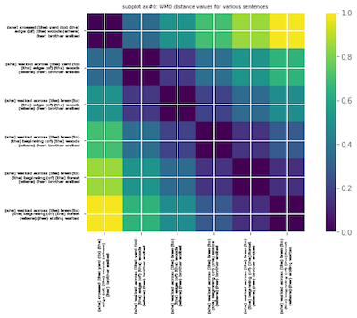
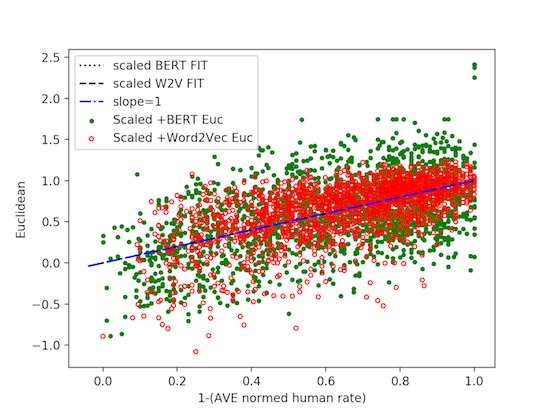

## Table of contents
* [Repository](#Repository)
* [Prerequisites](#Prerequisites)
* [Illustrations](#Illustrations)   
* [Collaborator](#Collaborator)
* [Resources](#Resources)	 

## Repository
The aim of this repository is to analyze BERT and Word2Vec language models. 
We make use of cosine similarity, euclidean distance, as well as Word Mover's Distance (WMD) as a metric to quantify the similarity between sentences and words.
We also showcase some applications of the BERT contexualize embedding.


* [wmd_plot.py](https://github.com/danafaiez/NLP-Project/blob/master/wmd_plot.py) takes two documents, possibly consists of many sentences, 
preprocess them, finds the corresponding word vectors for each token (using Word2Vec embeddings), computes the (Euclidean) distance between all tokens present in both documents,
as well as the frequencies of each unique word in each document. At the end, it computes the WMD between the two documents.
You also have the option to make plots such as the optimal transport matrix.

* Most plot have a dependency on bmd.py which is the implementation of the WMD to BERT embeddings and is available upon request and contains a `TensorFlow 2.0`_ `Keras`_ implementation of
   `google-research/bert` with support for loading of the original `pre-trained weights`.
## Prerequisites
   * Project is created using Python 3.6 and Google Cloud/Colab.
   * [Google's pretrained model](https://github.com/mmihaltz/word2vec-GoogleNews-vectors) is used for Word2Vec embeddings.
   * To run this project, install the following:
 
   
   ``` 
   $!pip install stop-words
   $!pip install pyemd
   $!pip install bert-for-tf2
   $!pip install matplotlib
   $!pip install sentencepiece
   $!pip install numpy cython
   $!pip install POT
   $!pip install MulticoreTSNE
   $!pip install nltk
   ```

## Illustrations

*  The following two imshow plots illustrate the WMD and BMD between every two
   sentences: 
  
  1. "She ran across the yard to the edge of the woods where her brother waited."
  2. "She walked across the yard to the edge of the woods where her brother waited."
  3. "She walked across the lawn to the edge of the woods where her brother waited."
  4. "She walked across the lawn to the beginning of the woods where her brother waited."
  5. "She walked across the lawn to the beginning of the forest where her brother waited."
  6. "She walked across the lawn to the beginning of the forest where her sibling waited."

 
 

* The following plots are illustrations of BERT raw embedings of artificially crafted set of words; the first plot includes 4 sets of words which have no context, and
   the last plot includes the same words as before but embedded in 3 sentences. Principal component analysis (PCA) technique is used for dimensionality reduction. [PCA_plots_noncontext_bert_w2v.py](https://github.com/danafaiez/nlp/blob/master/PCA_plots_nocontext_bert_w2v.py) and [PCA_plots_withcontext_bert.py](https://github.com/danafaiez/nlp/blob/master/PCA_plots_withcontext_bert_w2v.py) are used to create these plots.
   

   

* This illustration is to compare the raw BERT and Word2Vec embeddings with human judgment on similarity of pairs of words embedded in a text. The plot shows the Euclidean distance between each pair of words and 1-(normalized average huamn rate)[human_rated_plot_BERT_W2V.py](https://github.com/danafaiez/nlp/blob/master/human_rated_plot_BERT_W2V.py).
and [plot_human_rate_euc.py](https://github.com/danafaiez/nlp/blob/master/plot_human_rate_euc.py). The values of Euclidean distance are scaled such that the range is [0,1].



* In the follwong two plots, the similarity between every k movie lines and a
reference sentence; each color represent a different movie and are organized
such that, starting from the first one, every other movie is chosen to be of
genre [thriller, crime, horror] while others are chosen such that they are not
of the mentioned genre. The two chosen reference documents for these plots can
be found in [readme_movie_refdoc.txt](https://github.com/danafaiez/nlp/blob/master/readme_movie_refdoc.txt).


   

As an example, the k lines most similar to our chosen reference in movie
'suspect zero' is the following:

"Shut the fuck up or I'll shut you up.. Agent Kulok, that boy, as we speak, is
in Hawkins' truck, probably still alive, in a dark refrigerated compartment,
   shivering in just a T- shirt: put yourself in his mind, freezing, terrified,
   wanting his mother. Put yourself in his mother's place, desperate, imagining
   the worst is happening as she pleads, back there at the rest stop, for
   someone, anyone, to listen to her. This is not hypothetical, this is real. It
   is happening now and you can do something about it.. Listen to this guy? Can
   you believe this? He'll never change. Born a liar, first word out of his
   mouth was a lie. Make up a story, always a story, any goddamn story, to save
   his ass.. When I was at the rest stop, there was a young boy, maybe ten, and
   his mother. Darryl Hawkins, Zero, abducted the boy in the men's room. I tried
   to stop him. He cold-cocked me --"

This type of plot can be used to track any dialogue while comparing its context
to a chosen reference document. For instance, the movie 'detroit rock city' in the right plot is considered of the genre [comedy, music] and yet 
has a few lines that seems to be similar to the chosen reference in [readme_movie_refdoc.txt](https://github.com/danafaiez/nlp/blob/master/readme_movie_refdoc.txt). 
The lines of the movie are:

"So, you see if it wasn't for me, me and my **friends** would be at that KISS
concert right now... together.. Just one, **Father**, but **boy** was it a doozy..
Prepare to receive the Act of Penance. How many sins have you **committed** since
your last **confession**?. Forgive me, **Father**, for I have **sinned**. This is my first
**confession** in... well... a really long time."

The similarity of these lines to the reference is most likely due to the
existance words in bold.

## Collaborator
   This project is in collaboration with [Drew Bischel](https://github.com/cognagent).

## Resources
   Here are some of the resources we made use of in developing this project:
   * [Peter Baumgartner's blog](https://pmbaumgartner.github.io/blog/word-movers-distance-exploration/)
   * [From Word Embeddings To Document Distances](http://proceedings.mlr.press/v37/kusnerb15.pdf)
   * [google-research/bert/modeling.py](https://github.com/google-research/bert/blob/master/modeling.py)  
   * [Stanford's Contextual Word Similarities(SCWS)](http://ai.stanford.edu/~ehhuang/)
   * [Improving Word Representations via Global Context and Multiple Word Prototypes](https://nlp.stanford.edu/pubs/HuangACL12.pdf)


